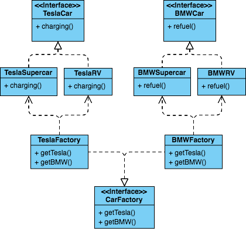
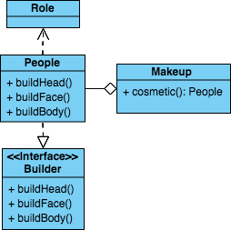

## 簡單工廠模式(Simple Factory）
定義一個類別來負責建立其他類別的實例，這些被創建的實例通常具有共通的父類或介面

## 工廠模式(Factory Method）
定義一個工廠介面，由實作該介面的各個子類別去決定該工廠要實作出什麼類別，也就是
將每個實作內容交由子類別來決定，跟簡單工廠模式比會有很多不同種類的工廠各自實作
不同種類的類別，而非單一類別來實作多種類別

 
## 抽象模式(Abstract Factory）
定義一個抽象工廠介面來制定該工廠所有產品物件建立的介面，每個產品具題實現由各個繼承該抽象工廠介面的類別來實現

 
## 工廠模式總結
 1. 抽象模式: 有許多不同工廠各子生產產品，每個產品可能有`多個`等級
 2. 工廠模式: 有許多不同工廠各子生產產品，每個產品只有`一個`等級
 3. 簡單工廠模式: 只有一個工廠，來生產不同產品

## 建造者模式(Builder)
將一個組成複雜過程的類別，將其內部組成流程一一拆分出成一個介面，再統一
由一個獨立的類別進行組裝，比如有一個角色有頭、臉、手需要化妝，每個部分都
非常耗時且不同角色有不同的妝，但都有一個共通點就是化妝的部位都一樣不會變
，將每個部位化妝獨立出來等畫完後在組裝起來就是一個角色，這就是建造者模式

> 與工廠模式來比，建造者模式只提供一個產品的組件在由統一指揮者來將產品組裝
而工廠模式則是提供完整產品不需要組裝